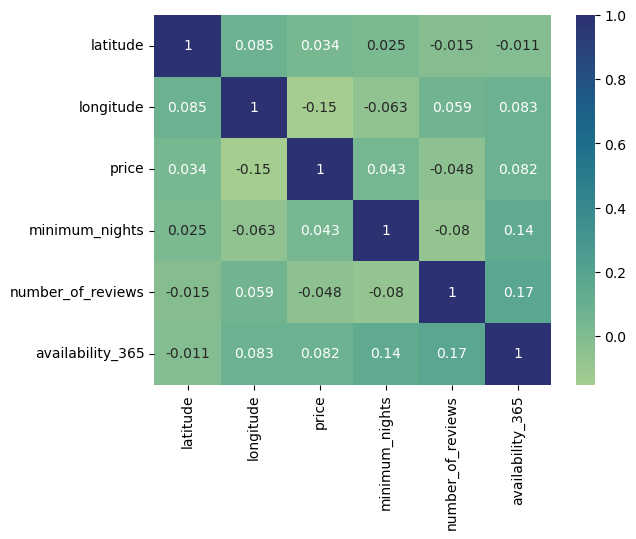

<!-- # Machine Learning Airbnb Project Proposal -->
### **Authors** : Aditya Shukla, Rithesh Rajasekar, Fardeen Khimani, Akash Mahesh, Charan Tiruveedhi

&nbsp;

## **Introduction/Background**

Airbnbs are a recently emerging form of modern real estate that has significantly grown in popularity. It allows individuals and owners to easily rent out properties to any guests. In terms of literature review, there have been various reviews on the "sharing economy” since the Airbnb business has emerged. While discussing the sharing economy, literature reviews discuss the hedonic pricing models between airbnb and other forms of short-terms to analyze the competitive pricing (Hati et al., 2019). They analyze the impact of certain variables such as physical characteristics, location, host characteristics, and reviews. 

&nbsp;

## **Problem Defintion**
Airbnb gives a general estimate or a large range of prices that could allow an AirBnb investor to price their property. However, a range is a very difficult estimator for an investor to accurately price their rental since they would have to manually compare their property to other properties. We aim to use supervised machine learning using several features including neighborhood, location, room type, and number of total reviews on the property based on historical New York City Airbnb dataset from Kaggle. The model will predict the appropriate price that a property owner should charge to his or her client. In addition, we plan on generally using unsupervised machine learning to predict the occupancy rate of a property, which will be defined as the number of the days a property is occupied out of 365 days (1 year), based on the K-Means clustering techniques.

Data Set: <a href="https://www.kaggle.com/datasets/dgomonov/new-york-city-airbnb-open-data">https://www.kaggle.com/datasets/dgomonov/new-york-city-airbnb-open-data</a>

&nbsp;

## **Methods**
This first step before jumping into the supervised and unsupervised models will be preprocessing the data to feed into training and testing the models. Since the machine learning models can only understand and perform optimization calculations on numericically encoded data, the categorical variables must be one-hot encoded. Next, the data will be cleaned to ensure that all the features and the resulting label will not contain any null data. From there, standard scaling will be applied individually to each feature since this is known to produce more stable models and provide better linear correlations. Additional feature engineering can be performed from this state using PCA for feature reduction and evaluated to see its effectiveness. 

For the supervised model we can potentially use multiple regression analysis. In order to evaluate the correlation of the variables, the correlation coefficient or regression equation can  be used. Multiple regression models can determine which characteristics are the most important to explain the dependent variable. Based upon literature, this model can be achieved using the Airbnb price projection as separate and dependent variables like Airbnb prices, property size, property type, number of bedrooms, etc (Zulkifley & Hamizah, 2020). We can use the Airbnb price as a set target or dependency variable, while other attributes are set as independent variables to determine the main variables by identifying the correlation coefficient of each attribute. In addition, to starting a simple linear regression model, Ridge Regression can be used to add a small amount of bias into the model in an attempt to reduce the standard error and attempt to resolve potential issues with overfitting to the training data. Lastly, more advanced Neural Networks will be used to performanmce increases using non-linear layers such as ReLU for this complex regression task.

Unsupervised learning involves implementing machine learning algorithms to analyze and cluster unlabeled datasets. One such technique is K-means clustering, where we can use data points such as neighborhood, room type, and price to predict the occupancy rate of an Airbnb property (Tajane et al., 2019). 

There is even existing research that applies K-means clustering to predicting AirBnB housing prices, however the paper does mention some pitfalls that can cause the model to perform worse than desired (Rezazadeh et al., 2019). Namely, a homogeneity in prices caused some clusters to not have as much training. We can rectify this by making sure we have a robust dataset with houses at various price points.

&nbsp;

## **Results and Discussion**
#### **Intial Feature Engineering**
Out of the total set of features, through research the initial set of features used was neighbourhood_group, neighorbourhood, latitude, longitude, room_type, price, minimum_nights, number_of_reviews, reviews_per_month, and availability_365 with the label being the actual price per month. Using the pandas library encoding, we encoded the categorical variables neighbourhood_group, neighorbourhood, and room_type using one-hot encoding. It is worth mentioning that the alternative form of encoding these categorical variables is ordinal encoding but this gives an ordering to the categories which is not approrpriate for the specified categorical variables. Lastly, the sklearn Standard Scaler was used to indivdually scale each of the features to have a mu=0 and sigma=1. Data visualization is a really important step after preparing the data before feeding it into any type of model. A correlation matrix was used in unison with a heat map to show any linear relationship between variables. 
 

## **Supervised Machine Learning**
#### **Aggregated Results**

| Model | R2 Score | RMSE|
| ----  | -------- | ----|
| Linear Regression (base)| -4.57e+24 | 4.2e+14|
| Ridge Regression (base) | 0.156 | 180.53|
| Log Tranformed Ridge Regression| 0.52| 0.48|
| Log Transformed Neural Network | 0.55 | 0.464|
| Log Transformed Ridge Regression with PCA| 0.53|0.48| 
|Log Transformed Neural Network with Coordinate Feature Cross| 0.565  | 0.455|

For the logical progression from one model to another in addition to explainations for why each model either performed well or did not perform well, please look below.

#### **Linear Regression Model**
The first model created using the processed data was a simple Linear Regression model with the Sklearn library. The solution to the model minimized the least squared error, producing a closed form solution. With an average price of $150.59 in the testing data, the Root Mean Squared Error (RMSE) was 420302936289073.50. The R2 Score which is a measure of correlation between 0 and 1, with 1 indicating the highest level of correlation was -4.5743929991781987e+24. At first it may be perplexing to see to a negative R2 Score but this simply means that the model is performing extremely poorly. The initial thought was that this could be due to overfitting so Ridge Regression was the immediate progression.

#### **Ridge Regression Model**
The Ridge Regression model introduces the L2 regularization term in order to slightly increase the bias in hopes of significanly reducing the standard deviation and the possibility of overfitting. With alpha=0 representing the standard linear regression, our testing includign alpha values from 0 to 2. With an extremely low alpha value of only 1 the RMSE significanly decreased to 180.53 and the R2 Score increased to an acceptable baseline of 0.156. The graphs below displays the change in R2 score and RMSE as alpha (regularization term) increases, showing that only an intial alpha value makes a significant improvement.

#### **Log Transformation**
In order to build an improved ridge regression model, which is built upon the linear regression model, the distributions of the residual plot should be as close to normal as possible. This will help establish the lienar relationship. The residual plot below showed the right skewness. This can be fixed through a log transformation of the labels (prices). It is important to remember this transformation and undo the log transformation when considering the actual predictions of the model.

After applying the crucial log transformation, the performance dramatically increased of the Ridge Regression Model (with alpha=1) to an R2 Score of 0.52 and RMSE of 0.48 (after the transformation). The increased performance of the model can be explained by the new historgram of the residuals which shows a normal distribution. The weights of the trained model are also shown below, illustrating which features play a larger contribution to the prediction of the model.

#### **Neural Network**
Advancing from simple ridge regression, a neural network was attemped in order to increase the performance of the model use the log transformed label data. In the model, ReLU was used to introduce non-linear layers into the model. Various hyperparameters were tuned including number of epochs, neural network hidden layer sizes, and the learning rate. Using a Neural Netork with hidden layer sizes 256, 64, and 32 and a learning rate of 0.005, the number of epochs were tested to see the resulting R2 Score and RMSE.

 
Using different plots for visualization and testing various combinations, the neural network with a learning rate of 0.005 training for 30 epochs resulted in the best result of an R2 Score of around 0.55 and RMSE of 0.48 (transformed). The tuning of the model and its paramters will continue to be improved into the next phase.

#### **PCA - 1D Coordinates**
One of the potential issues with the current data was considering latitude and longitude as seperate features. Therefore, the relationship of each of these features to price are individually considered. In a attempt to resolve this, PCA was used to combine latitude and longitude into a one single feature that represents the relative coordinates of the properties. The Ridge Regression Model (with alpha=1) using the PCA preprocessing resulted in an R2 Score of 0.53 and RMSE of 0.48. Therefore, this technique did not end up producing any results that can be considered significantly better. This avenue of considering latitude and longitude will be further explored using alternative techniques.

#### **Feature Cross Coordinates**
The last that was tried was using the concept of a feature cross. Once again, the goal of this technique was to see if the model would perform better if the latitude and longitude which determine the location, uneqivocally one of the most important features could be considered together. Looking at the latitude and longitude coordinates in a grid format, a feature cross was applied between these two features. While this would not seperate all 4 quadrants, this seperates the points between the diagnal quadrants which potentially could have helps the model to perform better. When implemented using a neural network with the log transformed data, the results did not improve significantly as the R2 Score was about 0.565 with a RMSE of 0.455 after about 70 epochs.
 

## **Unsupervised Machine Learning**
#### **Aggregated Results**

| Model | Error|
| ----  | -----|
| KMeans (base)| 120.82|
| KMeans with Standard Scaling | 126.57|
| GMM (base)| 122.43|
| GMM with New Weighting | 122.37|

For the logical progression from one model to another in addition to explainations for why each model either performed well or did not perform well, please look below.
#### **KMeans Base**
The base KMeans clustering model attempted to predict the occupany rate for a Airbnb property by looking at which cluster the property falls into and getting that specific cluster's average occupany rate. In order to analyze what the appropriate number of cluster should be, the elbow method was used by plotting the model's distortion for each number of clusters used. In addition, we found the RMSE between the predicted and the actual occupany for the properties. Using the below method, the optimal number of clusters resulted in a RMSE of 120.82 days. These two graphs are shown below.
 

#### **KMeans with Standard Scaling**
The base KMeans clustering did not provide very accurate results. One thought process was that this issue could be due to not applyig the Standard Scaling to the different attributes used by the model. This could potentially throw off the Ecludian distances when calculating the clustering. The model actually performed worse with a RMSE of 126.57 as Standard Scaling may sckew values uneccessarily. The graphs for the distortion/elbow method and RMSE and shown below.
 

#### **GMM Base**
One reason that KMeans may not work well in certain clustering tasks is due to the fact that KMeans provides hard clustering assignment. This may not work for Airbnb properties as a property could equally belong to two different clusters. As a result, the predicted probabilities that GMM provides was used to create a weighted prediction for the occupany rate of an Airbnb property. The accuracy was however still not very high was the RMSE was 122.43. The graph below shows how the RMSE changes as the number of components change.
 

#### **GMM with New Weighting**
The last idea implemented with GMM was changing how the average occupany for each component was calculated during the training step. Rather than using a simple average of all the training points assigned to that cluster(using argmax), a weighted average was applied with the training data to calculate the occupany of each component. The accuracy still unfortunately reamined relatively the same at a RMSE of 122.37. The graph below shows how the RMSE changes as the number of components change. This last trial shows that clustering may not be a feasible task either with the limited amount of attributes in the data or a more complicated model may be neccessary in order to capture the complex relationships that determine occupany.
 

## **Conclusion**

Overall, the supervised model to predict the price of a Airbnb property was relatively successful with a top R2 Score of 0.565. This model can be further expanded in the future by continuing the process of hyperparamter tuning and trying alternative architecture structures. On the other hand, the unsupervised model using clustering techniques to predict the occupany was not as successful even after trying many different variations. This is likely due to the fact that occupany is a very complex problem to solve with the few attributes given. In additition, the simple Ecludian distances may not capture the relationships among properties very well. This can be expanded in the future by trying alternative models that are more complex. Lastly, throughout this project we learned a key point that feature engineering and the quality of the data fed into the model is just as important as the model itself. This is a key point that we want to highlight as part of our project and methodology. 

&nbsp;

## **Works Cited**
Hati, S. R. H., Balqiah, T. E., Hananto, A., & Yuliati, E. (2021, October 19). A decade of 
systematic literature review on airbnb: The sharing economy from a multiple stakeholder perspective. Heliyon. Retrieved October 6, 2022, from https://www.sciencedirect.com/science/article/pii/S2405844021023252 

Zulkifley, Nor Hamizah. “House Price Prediction Using A Machine Learning Model: A Survey of Literature.” ResearchGate, International Journal of Modern Education and Computer Science, 4 June 2020, https://www.researchgate.net/publication/347584803_House_Price_Prediction_using_a_Machine_Learning_Model_A_Survey_of_Literature.

Tajane, Sakshi et al., “House Pricing Using K-Means Clustering.” Journal of the Gujarat Research Society, 8 Dec. 2019, http://www.gujaratresearchsociety.in/index.php/JGRS/article/view/1378. 

Rezazadeh, Pouya & Nikolenko, Liubov & Rezaei, Hoormazd. (2019). Airbnb Price Prediction Using Machine Learning and Sentiment Analysis. 

&nbsp;

## **Timeline**

| Dates | Milestone |
| ---- | ------------ |
| 10/07/2022 - 11/10/2022 | Finish Supervised Model |
| 11/11/2022 | Project Midpoint |
| 11/12/2022 - 12/05/2022 | Finish Unsupervised Model |
| 12/06/2022 | Final Project Due |

&nbsp;

